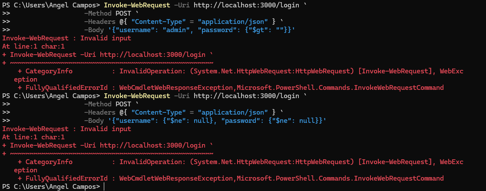

ETAMU CSCI 310 Project Report

Angel Campos, Tyler Pham

**XSS Vulnerabilities**

The file that is vulnerable to XSS impact in our project is called
xss.js. The following points highlight the vulnerabilities to attackers.

{width="6.5in"
height="3.370138888888889in"}

1.  Direct Output Without Escaping:

    a.  When a user submits a comment, the input is directly inserted
        into the HTML response with:

        i.  \
\${comment}\</div\>

> If the input contains malicious HTML or JavaScript, in our case as:
>
> \<script\>alert(\'SYSTEM COMPROMISED\')\</script\>
>
> The browser interprets this as a part of the document, leading to
> Cross-Site Scripting (XSS)

2.  The app doesn't validate or sanitize the input, allowing malicious
    HTML/JS to be embedded in the response.

3.  Impact:

    a.  Attacker could inject a script to steal user cookies or session
        data

    b.  Redirect users to malicious sites

    c.  Execute unauthorized actions

**XSS Prevention**

The file that prevents XSS is called xssprev.js. The following points
highlight the prevention methods taken to increase security.

{width="6.5in"
height="3.4583333333333335in"}

1.  Input is sanitized using the he.escape function:

    a.  const safeComments = comments.map(comment =\>
        he.escape(comment)).join(\'\<br\>\');

> This encodes special HTML characters (\<,\>,&, etc) into their
> corresponding HTML entities: (&lt; &gt;, &amp;, etc).
>
> Example:
>
> Input: \<script\>alert(\'SYSTEM COMPROMISED\')\</script\>
>
> Output: &lt;script&gt;alert(&#x27;SYSTEM
> COMPROMISED&#x27;)&lt;/script&gt;

2.  Rendering Safe Content

    a.  By encoding potentially dangerous characters, the browser
        displays them as plain text, effectively neutralizing any
        malicious scripts.

3.  Why it Works

> XSS attacks rely on browsers interpreting user input as executable
> code. Encoding input ensures that even if a user enters malicious
> content, it is rendered as text, not executable code.

In summary for this portion of the project, Xss.js -\> Directly rendered
in HTML response, Vulnerable due to redirecting, executes scripts if
included in input. Xssprev.js -\> encoded before rendering, safe due to
input encoding, renders scripts as plain text.

**NoSQL Injection Vulnerabilities**

For this part of the project, NoSQL injection is tested.

{width="6.5in" height="3.15625in"}

1.  User 'admin' and password 'password123' grant a successful login.
    However, because the username and password fields in the payload
    come directly from the user's input, inputs passed directly into the
    MongoDB query allow special characters or query operations (like
    \$ne, \$gt, or \$or) to modify the query behavior.

2.  MongoDB interprets these inputs as part of the query, which can lead
    to unintended results

How Attacks Work

The attacker can exploit this by crafting malicious payloads to:

1.  Bypass Authentication

    a.  Example Payload:

> {
>
> \"username\": \"admin\",
>
> \"password\": { \"\$ne\": null }
>
> }
>
> The \$ne (not equal) operator causes MongoDB to match any document
> where password is not null. As long as the username matches, the
> attacker gains access without knowing the real password.

{width="6.5in"
height="3.453472222222222in"}

2.  Inject Logical Conditions

    a.  Example Payload:

> {
>
> \"username\": \"admin\",
>
> \"password\": \"wrongpassword \|\| 1 == 1"
>
> }

The \|\| 1 == 1 is interpreted as a logical OR condition, which always
evaluates to true.

> MongoDB treats this as a valid query, bypassing the password check.

{width="6.5in"
height="3.433333333333333in"}

3.  Retrieve Unauthorized Data:

    a.  Example Payload:

> {
>
> \"username\": \"admin\",
>
> \"password\": { \"\$ne\": null }
>
> }
>
> The query matches any user document in the collection where both
> username and password are not null.
>
> Attackers can use this to infer valid credentials or other sensitive
> information.

b.  With a modified handler:

> if (user) {
>
> //return \'Login successful!\';
>
> return user;
>
> } else {
>
> return \'Invalid credentials\';
>
> }

Its able to retrieve sensitive information:

{width="6.5in"
height="3.6006944444444446in"}

**NoSQL Injection Prevention**

> After using the file nosqlprevinjection.js, attempts to bypass
> authentication, inject logical conditions, or retrieve sensitive data
> no longer work.
>
> {width="6.489583333333333in"
> height="2.5520833333333335in"}

Enchancements

1.  Sanitization with sanitizeInput:

    a.  Removes any \$ characters to prevent the use of MongoDB
        operators like \$ne, \$gt, etc.

    b.  Rejects non-string inputs (e.g., objects or arrays) by throwing
        an error.

2.  Validation:

    a.  Inputs must be strings, preventing JSON objects or malicious
        query structures.

Why This Works

1.  Sanitize Input:

    a.  Example:

> Input: { \"\$ne\": null }
>
> Output: { \"ne\": null } (Operators are neutralized.)

b.  Input: \"validUser\"

> Output: \"validUser\" (Safe inputs remain unchanged.)

2.  Validation:

    a.  Rejects any payload like

> {
>
> \"username\": { \"\$ne\": null },
>
> \"password\": { \"\$ne\": null }
>
> }
>
> And only accepts strings:
>
> {
>
> \"username\": \"admin\",
>
> \"password\": \"password123\"
>
> }

**DOS Prevention**

After implementing the dosPrevention.js script, attempts to overload the
server with multiple login requests or any malicious input designed to
flood the system with excessive traffic are effectively blocked.

Enhancements

1.  Rate Limiting:

    -   Purpose: Limits the number of login attempts that a user can
        make within a specific time period.

    -   Prevention: Ensures that brute-force or other DoS attacks are
        mitigated by rejecting excessive requests within short time
        intervals.

    -   Implementation: Introduces a counter to track login attempts per
        user IP or session, rejecting requests when the threshold is
        exceeded.

2.  IP Blocking:

    -   Purpose: Blocks repeated requests from the same IP address once
        the rate limit is exceeded.

    -   Prevention: Protects the application from continuous malicious
        requests from the same source by temporarily blocking the
        offending IP.

Example of Rate Limiting:

-   Input (1st attempt): { \"username\": \"admin\", \"password\":
    \"password123\" }

    -   Allowed: This request is accepted.

-   Input (5th attempt, rapid requests from same IP): { \"username\":
    \"admin\", \"password\": \"wrongpassword\" }

    -   Rejected: After the threshold is exceeded, further requests from
        the same IP are blocked.

Example of IP Blocking:

-   After repeated invalid login attempts from a single IP address, the
    server will block further requests from that IP for a defined period
    (e.g., 10 minutes).

Why This Works

1.  Rate Limiting:

    -   Prevention: Limits the number of attempts a user can make to
        login in a short period of time. This means that even if an
        attacker tries to brute-force passwords, the rate at which they
        can send requests is limited, slowing down their attack and
        potentially blocking further attempts if the limit is exceeded.

2.  IP Blocking:

    -   Prevention: This strategy ensures that if an IP address exceeds
        the allowed request count, it is temporarily blocked, preventing
        the attacker from flooding the server with more requests.

{width="6.5in"
height="1.0194444444444444in"}

After spamming a couple login requests, it denies me

**Conclusion**

Injection vulnerabilities, including NoSQL injection, are among the most
critical risks identified by organizations. Preventing these attacks:

-   Protects user data and application integrity.

-   Preserves the organization's reputation and user trust.

-   Mitigates legal, financial, and ethical risks.

By validating inputs, sanitizing queries, and following secure coding
practices, you can ensure that your application is resilient against
these threats.
